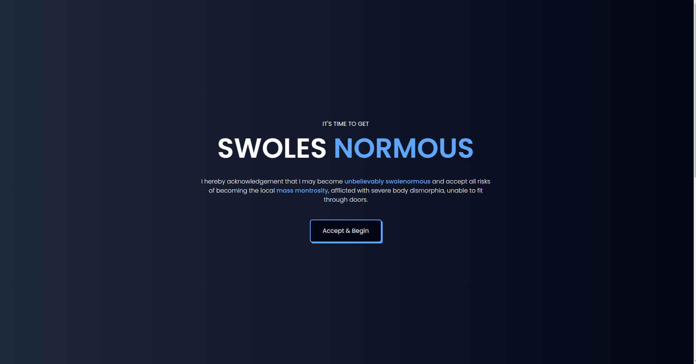

# 🏋️‍♂️ Gym Workout Generator  

**Personalized AI-powered workout plans based on your fitness goals**  

  

## 📌 Overview  

The **Gym Workout Generator** is a web application designed to generate **custom workout plans** based on user preferences, targeted muscle groups, and fitness goals.  

It dynamically selects and shuffles exercises using **smart algorithms** to ensure balanced, effective, and engaging workout routines.  

## 🎯 Features  

✅ **Personalized Workouts** – Based on muscle groups & goals  
✅ **Workout Modes** – Individual & group training options  
✅ **Smart Exercise Selection** – Avoids repetition & optimizes variety  
✅ **Rest & Tempo Adjustments** – Adapts intensity based on the goal  
✅ **Dynamic UI** – Responsive & interactive  

## 🛠️ Tech Stack  

| Technology     | Purpose |
|---------------|---------|
| **React.js**  | Frontend Framework |
| **Tailwind CSS** | UI Styling |
| **JavaScript** | Logic & State Management |
| **React Hooks** | Functional Component State Handling |
| **Node.js** (optional) | Backend Integration (Future Scope) |

---

## 🚀 Installation & Setup  

You can either **run the project locally** or visit the deployed version on **Netlify**.

### 🌐 Live Demo  

You can see the live demo of the app hosted on Netlify here: [Swoley Fit Demo](https://swoley-fit-niloofar.netlify.app/)

### 📋 Prerequisites  

Ensure you have **Node.js** and **npm** installed.  

```sh
npm install npm@latest -g

🔧 Installation

1️⃣ Clone the repository

git clone https://github.com/your-username/gym-workout-generator.git
cd gym-workout-generator

2️⃣ Install dependencies
npm install

3️⃣ Run the development server
npm run dev

4️⃣ Open in browser
Navigate to: http://localhost:5173


🏗️ Project Structure

/src  
 ├── /components  
 │   ├── Button.jsx         
 │   ├── ExerciseCard.jsx    
 │   ├── Generator.jsx       
 │   ├── Hero.jsx       
 │   ├── SectionWrapper.jsx        
 │   ├── Workout.jsx 
 │  
 ├── /utils  
 │   ├── function.js  
 │   ├── swoldier.js       
 │  
 ├── App.jsx               
 ├── index.js              
 └── main.jsx           

🧠 How It WorksThe workout generation is powered by custom algorithms inside generateWorkout.js. Here's how it works:

1️⃣ Filters exercises based on the selected workout mode (individual/group).
2️⃣ Shuffles & assigns muscle groups dynamically for variety.
3️⃣ Determines exercise types – compound vs. accessory.
4️⃣ Selects optimal reps, rest time & tempo to match the fitness goal.
5️⃣ Returns a structured workout plan ready to be displayed.
[
The workout generation is powered by custom algorithms inside generateWorkout.js. Here's how it works:

1️⃣ Filters exercises based on the selected workout mode (individual/group).
2️⃣ Shuffles & assigns muscle groups dynamically for variety.
3️⃣ Determines exercise types – compound vs. accessory.
4️⃣ Selects optimal reps, rest time & tempo to match the fitness goal.
5️⃣ Returns a structured workout plan ready to be displayed.


  {
    "name": "Bench Press",
    "tempo": "2-1-1",
    "rest": "90s",
    "reps": 8,
    "muscles": ["Chest", "Triceps"]
  },
  {
    "name": "Squat",
    "tempo": "3-1-1",
    "rest": "120s",
    "reps": 10,
    "muscles": ["Legs", "Glutes"]
  }
]

🛤️ Roadmap

 🏆 Add more workout variations
 🎨 Enhance UI/UX with animations
 🏋️‍♂️ Add video demonstrations for exercises
 📊 Track workout history (future backend integration)


🤝 Contribution
Contributions are welcome & appreciated!

1️⃣ Fork the repo
2️⃣ Create a feature branch (git checkout -b feature/AmazingFeature)
3️⃣ Commit your changes (git commit -m 'Add some AmazingFeature')
4️⃣ Push to the branch (git push origin feature/AmazingFeature)
5️⃣ Open a Pull Request
